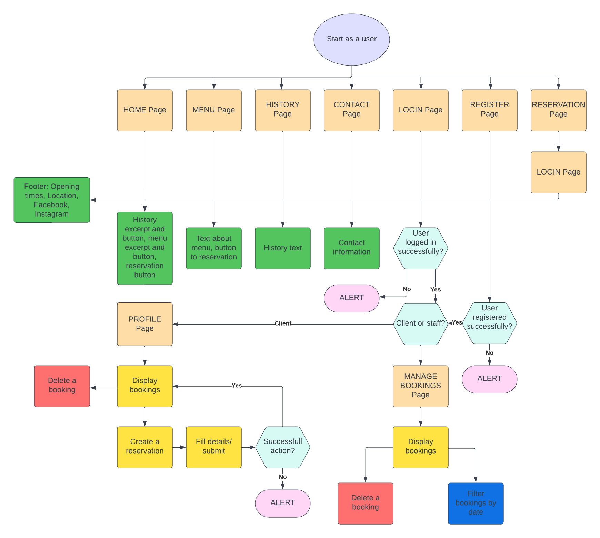
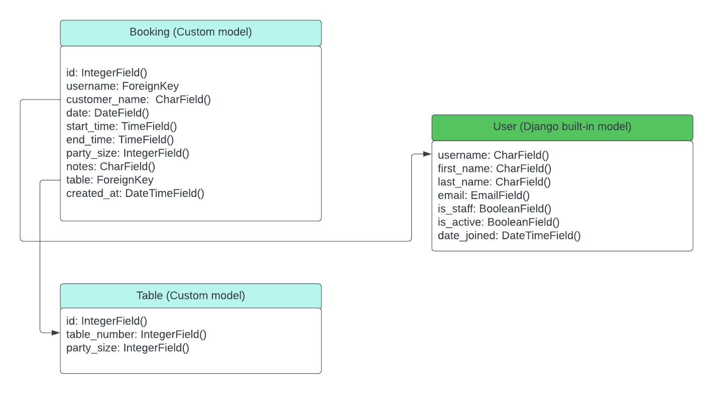
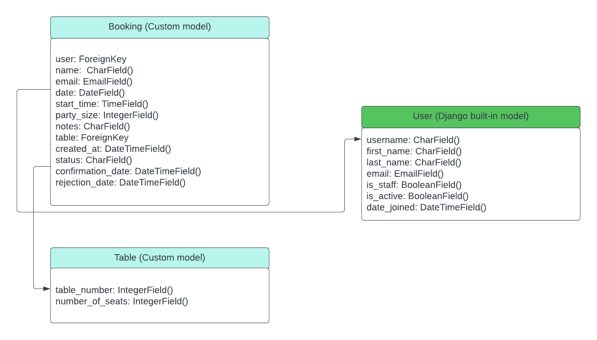

# Ekstedt Booking Website

## Overview
This is a project designed and developed to create a complete experience for the clients of Ekstedt Restaurant. The users are given the possibility to create a booking, the admin is capable of approving it and the staff members are meant to manage all the bookings. In order to make a booking, an account registration is needed, while considering that the staff members have special permissions for controlling the data. 
The website was created by getting inspiration from a real life exclusive Restaurant Ekstedt, which is based in Stockholm. 
**Ekstedt Booking Website** was developed using Python3 (Django), HTML, CSS and JavaScript by storing the data in a PostgreSQL database.
  
The fully deployed project can be accessed at [this link](https://booking-system-ekstedt-80e2fb2174de.herokuapp.com//).  

## Table Of Contents
* [Overview](#overview)
* [UX](#ux)
    + [Strategy](#strategy)
    + [Scope](#scope-hr-)
    + [Structure](#structure-hr-)
    + [Skeleton](#skeleton-hr-)
    + [Surface](#surface-hr-)
        -[Color Scheme & Fonts](#color-scheme-and-fonts)
        -[Visual Effects](#visual-effects)
* [Agile Methodology](#agile-methodology)
* [Features](#features)
    + [Existing Features](#existing-features)
        - [User Registration and Authentication]
        - [Booking Interface]
        - [Feedback and Confirmation]
        - [Admin Interface]
        - [Database Integration]
        - [Basic Front-End Design]
        - [Testing]
    + [Future feature considerations](#future-feature-considerations)
* [Responsive Layout And Design](#responsive-layout-and-design)
* [Tools Used](#tools-used)
    + [Python Packages](#python-packages)
* [Testing](#testing)
* [Deployment](#deployment)
    + [Deploy On Heroku](#deploy-on-heroku)
    + [FORK THE REPOSITORY](#fork-the-repository)
    + [CLONE THE REPOSITORY](#clone-the-repository)
* [Credits](#credits)
    + [Content](#content)
    + [Media](#media)
    + [Code](#code)
* [Acknowledgements](#acknowledgements)

## Overview

The Ekstedt Restaurant Booking System is a project designed to facilitate online reservations for users while offering efficient booking management for the site owner. Key features include user registration and authentication, a user-friendly booking interface, immediate confirmation and feedback, an admin interface for booking oversight, and secure database integration. The project prioritizes UX design principles, security measures and thorough documentation. It aims to meet the goals for both the external users, seeking a seamless booking experience, and the site owner, aiming for effective online booking management.

  
The deployed project is available at [this link](https://booking-system-ekstedt-80e2fb2174de.herokuapp.com/).
  

## UX

The site was created with respecting The Five Planes of Website Design: 

### Strategy

**User Stories:**  

|   EPIC                                |ID|                                User Story                                                   |
| :-------------------------------------|--|:------------------------------------------------------------------------------------------- |
|**Project Setup**                         |  ||
|                                       |1A| As a project manager, I want to clearly define project goals so that I have a clear understanding of what needs to be achieved.|             
|                                       |1B| As a developer, I want to set up version control using Git so that the project can be effectively managed.|
|**User Authentication**                  |  ||
|                                       |2A| As a user, I want to be able to register for an account so that I can access personalized features.|
|                                       |2B| As a user, I want to be able to log in to my account securely.|
|**Front-End Development**                     |  ||
|                                       |3A| As a user, I want to see a visually appealing and user-friendly booking interface.|
|                                       |3B| As a user, I want the design to follow UX principles to ensure a positive and intuitive experience.|
|**Booking System**                            |  ||
|                                       |4A| As a user, I want to fill out a booking form with the date, time, and number of guests.|
|                                       |4B| As a user, I want immediate feedback on the success of my booking.|
|                                       |4C| As a user, I want to receive confirmation emails or messages for successful bookings.|
|**Admin Interface**                               |  ||
|                                       |5A| As a site owner, I want to access a basic admin dashboard to view and manage bookings.|
|                                       |5B| As a site owner, I want the ability to confirm or reject bookings from the admin dashboard.|
|**Database Integration**                           |  ||
|                                       |6A| As a developer, I want to set up a database to store booking details.|
|                                       |6B| As a site owner, I want to have basic CRUD functionality for managing bookings.|
|**Testing**                         |  ||
|                                       |7A| As a developer, I want to develop automated tests to assess the functionality and responsiveness of the booking system.|
|                                       |7B| As a developer, I want to document test results, including identified bugs and fixes.|
|**Documentation**                      |  ||
|                                       |8A| As a developer, I want to create a README documentation that articulates the project's purpose, target audience, and security features.|
|                                       |8B| As a developer, I want to document the data schema and deployment procedure for future reference.|
|**Model Code Efficiency**                      |  ||
|                                       |8A| As a developer, I want to implement efficient model code to handle booking-related operations.|
|**Deployment**                      |  ||
|                                       |8A| As a developer, I want to document the deployment procedure in the README.|
|                                       |8B| As a developer, I want to ensure the deployment is well-structured and easy to follow.|

**Project goal:** 
The general goal of the project is to create a website for restaurant Ekstedt, which enables an efficient and user-friendly online restaurant booking system that allows users to easily book meals for themselves and others, specifying the desired time and date. Simultaneuosly, the system aims to empower the site owner by providing a robust admin interface for efficient management of online bookings at their eatery.

### Scope

**Simple and Intuitive User Experience:** 
* Design a user interface that is easy to navigate, consistent with the graphical profile and theme of the restaurant.
* Create a header, footer and a visible navbar throughout the website for seamless navigation.
* Implement an intuitive booking form with clear fields for date, time and the number of guests.
* Ensure visual notifications for all user actions and maintain user orientation during website navigation.
* Prioritize accessibility guidelines for an inclusive and user-friendly experience.

**Relevant Content:**
* Display essential information about the restaurant, including its name, location, phone number and email.
* Present the menu sets and wines which are available to order for the clients.

**Features for an Upgraded Experience:**
* Develop a reservation section allowing users to view all available tables for a specific date and time.
* Implement a profile page for users to manage upcoming bookings.
* Introduce a staff-member account with access to a management interface for handling all user bookings.
* Provide quick booking confirmation with immediate feedback.
* Incorporate notifications or reminders for upcoming reservations to enhance user engagement.

**Different Client and Staff-Member Accounts:**
* Establish distinct account types for clients (users making reservations) and staff members (site owner and administrators).
* Allow clients to register, log in and manage their accounts.
* Enable staff members to access an admin interface for efficient booking management, confirmation, and rejection.
* Implement filters visible only to staff members for finding specific reservations.

**Responsiveness:**
* Develop a responsive website that works seamslessly across various devices, including desktops, tablets and mobile devices.
* Optimize the user interface for different screen sizes, ensuring a consistent and enjoyable experience.

### Structure

The website's structure is divided into nine different pages with content which is depended on authentication and if the user is client or a staff member.

* **Home:** This is the entry point of the website where users can find excerpts and hyperlinks to history, menu and reservation pages.
* **History:** This page provides users with information about restaurants history and past. Including information about its establishment and the chef's background and culinary philosophy.
* **Menu:** The menu page for Ekstedt restaurant displays the set menu and available pairings. The page also includes a link to the restaurant's wine list on Star Wine List and a reservation button.
* **Reservation:** The page includes information about reservation policy and a button for making a booking.
* **Profile:** The page displays users' reservation history and allows them to manage their bookings.
* **Contact:** Contact page of the restaurant Ekstedt includes info about the address, phone number, and email for reservations and general inquiries.
* **Login:** A page where users need to log in to access and manage their accounts.
* **Manage bookings:** This page is only accessible for staff members and allows them to manage reservations, view bookings, and update the status of tables.
* **Register:** This page allows new users to register and create an account to the website.
* **Profile:** This page allows the users see their past bookings and details.

#### Flowchart

The flowchart for the project was created with using <b>LucidChart</b>.  

  

### Skeleton

**Wireframes** 
The wireframes for mobile and desktop were created by [Balsamiq](https://balsamiq.com/) tool and can be viewed 

Here:

 

 

**Database** 
In the project ElephantSQL was used for PostgreSQL relational database in data storing.
Two diagrams were created to represent the relationships between the tables. The first diagram was created before the website was developed, and it was used to identify the most relevant and useful attributes and tables. The final diagram was created after the website was developed, and it reflects the changes that were made to the attributes and tables.
 

Initial Model

 

During the development, it was decided that the admin interface needs a booking confirmation history interface, for better data
analitics. Therefore the diagram changed quite considerably.

Final Model

 

 

### Surface

#### Color Scheme and Fonts
* The fonts that were used in this project were taken from [Google Fonts](https://fonts.google.com/): 
* h1 - h3 elements: *Playfair Display*
* h4 , p, td, th elements: *Lato*
* font color: #white
* Webpage background image was found [Freepik](https://www.freepik.com/):

## Agile Methodology
This project was developed using the Agile Methodology. 
Epics and user stories were registered using [GitHub](https://github.com/). As User Stories were accomplished they were moved from **No Status** to **ToDo**, **In Progress** and **Done** lists.